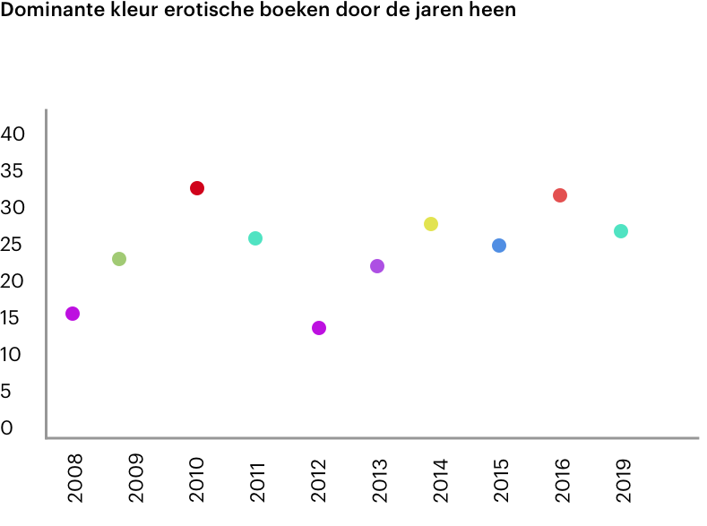
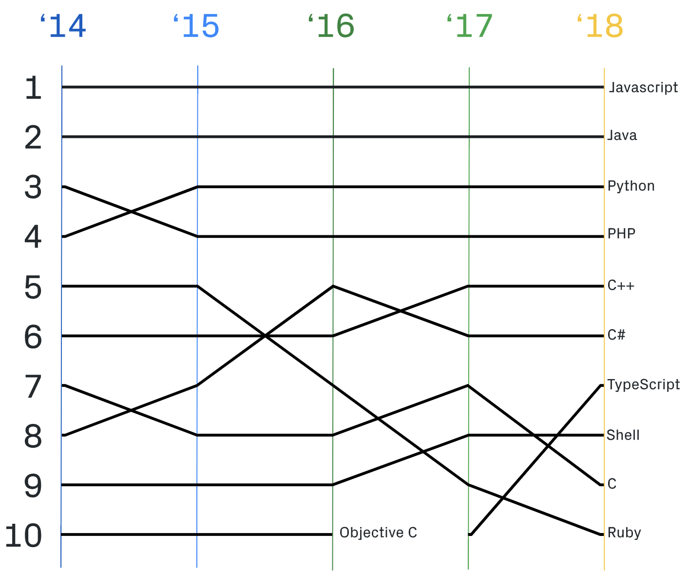

# Functional-programming

---------

## Description

## Table of content

* [Installing](#installing)
* [Research questions](#research-questons)
* [Hypothesis](#hypothesis)
   * [Sub-questions](#sub-questions)
   * [Important variables](important-variables)
   * [Code](#code)
   * [Libaries used](#libaries-used)
   * [Findings](#findings)
* [Still to do](#still-to-do)
* [Credits](#credits)
* [Proces](#proces)

## Installing

To install this project you need to do a few things to get up and running. Don't forget it needs the public API key from the [Openbare Bibliotheek Amsterdam](https://www.oba.nl/).

#### This creates a localhost with all the filtered API data

```bash
# Clone the repository
git clone https://github.com/Denniswegereef/functional-programming

# Change directory
cd functional-programming

# Create a .env file
touch .env

# Add public and secret key to the .env file
echo "PUBLIC=987654321
SECRET=123456789" >> .env

# Install dependencies
npm install

# Start application
npm run getMore

```
The browser hosts all the data on `http://localhost:8080`

#### When we wanna see the visualisation in our browser

## Research questions

* On which libary are the most horror books?
* Which color is the most used for a cover of books?
* Which word is the most commen in the summary of books?
* Which publisher has the most books in the OBA?
* Which word is most used in the title of books?
* Which books has the most translations of them?
* Are red and pink the most dominant colors used on erotic books?
* Are black and white the most used colors on horror books?

## Hypothesis

**Red or pink are the most dominant colors used on dutch erotic book covers of the last 10 years?**

The reason I did go for this hypothesis is mostly because you could really specify on one part of the data. Everybody has assumptions that red and pink are the most used colors but it's nice to finally make a real conclusion.

#### Sub questions

* What are the most dominant colors from books of another language?
* Do dominant colors very when you look at other years?
* What are the most dominant colors of differentes genres?
* What are the top 10 colors?

### Important variables

Before we can find answer the hypothesis we need to filter some data from the OBA api. You get back alot of data but also alot unnecessary for my use case. I did choose for the following structure to work with:

```js
{
  "title": "Vochtige streken / Charlotte Roche",
  "coverImage": "http://image.url/",
  "publication": "2008",
}
```

Well we only needed the coverImage and the publication year but it was nice to just also give the title maby for the future if I have plans to expand this visualisation.

But we are not there yet! We have the link to the coverImage of a book but we still need to grab the dominant color of it, there is in the code some magic who can extract a color pallete from most used to 'least' used than we add it to our object. I used [splashy](https://www.npmjs.com/package/splashy) for creating the pallete.

```js
"dominantColors": [
      "#dc242f",
      "#e5565f",
      "#c41c2c"
]
```

Since there are  16,777,216 colors it's kinda hard to make a visualisation about that. Probaly we have sometimes a double color when you work with all 450K books from the API. But since we only work with erotics who has far less books (only 525 by the time of writing this), the possibility we find doubles is almost zero.
But we wanna still wanna compare the colors, well good for us there is a package available who saves the day! It's called [nearest-color](https://www.npmjs.com/package/nearest-color) who you feed a array of giving colors too. And than you give a specific color and it's gonna see on which giving color it's living close too! Let's say we have these colors:

```js
{
  white:  '#FFFFFF',
  black:  '#000000',
  red:    '#FF0000',
  maroon: '#800000',
  yellow: '#FFFF00',
  lime:   '#00FF00',
  green:  '#008000',
  aqua:   '#00FFFF',
  teal:   '#008080',
  blue:   '#0000FF',
  navy:   '#000080',
  fuchsia:'#FF00FF',
  purple: '#800080'
}
```

It's gonna look for us the nearestColor on the matrix, once we found that we just add it to our beautiful data object we gonna use in the visualisation.

```js
"nearestColor": {
    "name": "red",
    "value": "#FF0000",
    "rgb": {
      "r": 255,
      "g": 0,
      "b": 0
  }
}
```

Well not we have everything we need to actually make our visualisation! We still need to slice and throw some data around to make it suits good for our visualisation. But we gonna do that with some d3 things on the client side for now. But for now we just put this data to a local json file to work with.

So in the end with a array with all the results for the last 10 years looking like this:
```js
{
  "title": "Kom naar bed, mijn lief / Anita Nair",
  "coverImage": "http://image.url/",
  "publication": "2008",
  "dominantColors": [
    "#aa131b",
    "#e09d9f",
    "#0c3684",
    "#ac4a4b",
    "#3c4f66"
  ],
  "nearestColor": {
    "name": "maroon",
    "value": "#800000",
    "rgb": {
      "r": 128,
      "g": 0,
      "b": 0
    }
  }
}
```

### Code server

Our code has some key parts to work with. In our working folder you can see the `server` and the `src` folder. Well in our `server` folder we actually do the work of making the connection to the API and outputting the data on your localhost on writing it to a local .json file. Depends on what you like and what we like to use. For now we use local .json because we wanna host it on github pages.

But if you actually wanna swap it around you can go to the getMultiple and change it around in the last `.then` right before we catch the errors.

Use this for a localhost:

```js
.then(response => {
  app.get('/', (req, res) => res.json(response))
  app.listen(port, () => console.log(chalk.green(`Listening on port ${port}`)))
})
```

Use this for writing it away it a `data.json` file:

```
.then(response => {
  fs.writeFile('src/json.json', JSON.stringify(response) , 'utf-8', (err) => {
    if (err) { console.log(err) } else { console.log('File has been created')
  }
})
```

Than we use 2 files in the `server` file to make all the requests. Well the proces has a few steps:
1. Create the giving url based on what we looking for for the OBA api
2. Fetch all XML
3. Parse the XML to JSON
4. Repeat this proces till we have all the requests (this is due the fact the OBA api handles 20 results for every requests, we use some kind of logic to repeat the proces till all we have all the results)
5. Slice all the unnecessary data away we don't need
6. Find the dominant color of a coverImage
7. Find the nearestColor of a image
8. Serve it well in one good looking array on your plate how you like

I won't go deeply in on the code but in the `server/oba-api.js` file we actually create the server request, and parse the XML to json. In the `getMultiple.js` we do all of the other steps.

### Code conclusion

The proces from fetching the data to actually make it somehow usuably for your visualisation took many iterations. I never did it before like this and it took me some time to wrap my head around it. I used about 5 different ways to make it more usuable. The big challange was to make more than 1 request. With Folkert-Jan we created on the first some sort of requests where we just made alot of requests and try to resolve them all at the same time. It worked somehow for about 30 requets but than the api thought 'no thank you' and just refused to give us more. Well it worked in some way to work with but it was not really elegant.

After some time I finally managed I found exacly the way how I wanna structure my data. With some help of Folkert-Jan and Titus for making it way more cleaning and reusable.

Well, but I must admit I learned **alot** from this project. I had some prior knowledge but this really made me look different to data. I've never worked with api before like this. And since all the ugly json, you had really look for how you wanna make it more friendly.

Also what I liked about is helping people getting there. I created some parts of nice code and since I helped some people they also use it (kinda proud).

But when I think about it there are also some points I still have to work on. Such as I just started without an idea what I wanna achieve. The first days I just did something? But the proces was going alot faster when I had a end goal what I wanted to do.

## Visualisation

My hypothesis was that I wanna see what color was used as most on erotic books. I created some fast sketches how I wanna show it and see how I wanna present my data.


### Inspiration

My first thought was just to keep it simple, because I had no experience in D3 whatsoever. I just didn't know how hard it could be to create a simple graph in d3. So my go to was at first this:



As I was slowly working towards this in D3 Titus came with a genius idea to do someting else. In the end a **multi line graph** what made alot more sense knowing what I wanted to show. This was exacly a cool nice way to present all the data I had. I had a way to show in 1 line graph the amount of colors I used, and on what position they were placed in each year. [Example inspiration link](whatsoever):




### Code

In the `src/booksd3.js` I put my first iteration, where I tried my first graph with all the colorful dots. But that's a deprecated idea. But it's still living there in case I have to get some code for my current visualisation in the `src/index.js`. And there is `src/geparkeerd.js` where the code is of a tutorial I watched, I'm not ready to delete anything yet.... :)

I can't really go in details with the code right now because It's still work in progress and not ready for the final result yet.

## Still to do

- [ ] Cleaing up my code
- [ ] Merge the oba.get and the api.getMore a little bit more usuable friendly
- [ ] Use the same code standards for every line
- [ ] Implement a linter :(
- [ ] Unit testing
- [ ] Make a threshold when you have alot of requests to don't overload the server

## Conclusion

In terms of the the first week where we didn't use D3 I learned so many things. I knew already some things of javascript but this really opened my eyes. I never used promises, actually understanding alot of functions to manipulate arrays and objects and learned working with alot more data. It was a week of fun and some frustation ofcourse if thing's didn't go well. But the wierd part is since I did so many iterations of making it more towards how I want it I'm just lefover with a great working piece of code. But I threw so many things away or don't use it right now. That really amazes me how long you can work and redo such a small piece of logic. But I'm soooo happy that I had it working *exacly* how I imaged to have it work.

I think I did a great job trying to make it functional. Ofcourse there are some parts that still need some love but the idea is there. And I'm not near done yet.


## Credits/links

[Tim Ruiterkamp](https://github.com/timruiterkamp)
[Folkert-Jan van der Pol](https://github.com/FJvdPol)
[Titus Wormer](https://github.com/wooorm)

[Oba API](https://zoeken.oba.nl/api/v1/)
